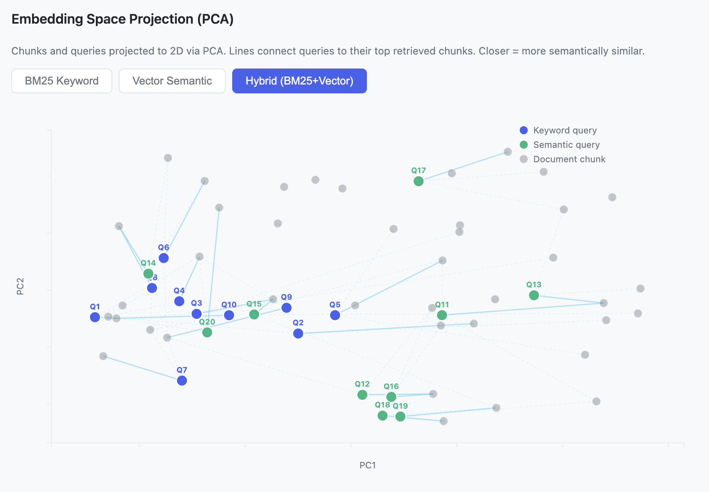
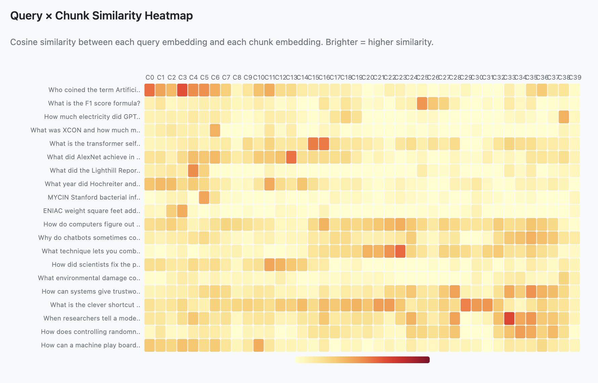

# EvalRAG

Composable RAG evaluation library. Build experiments by plugging together extractors, chunkers, embedders, retrievers, generators, and evaluators — then compare results across configurations.

- **Composable pipeline** — swap extractors, chunkers, embedders, retrievers, generators, evaluators like LEGO
- **Hybrid search proving ground** — built-in demo shows BM25+Vector outperforms either alone (+21% F1 lift)
- **Interactive HTML reports** — F1 scorecards, D3 charts, light/dark mode, timestamped exports
- **Embedding space visualizations** — PCA scatter plot with retrieval edges + cosine similarity heatmap
- **Local-first** — SentenceTransformers + Ollama, no API keys needed
- **Zero-config hello world** — one command, full experiment, publication-ready report
- **Pure Python BM25** — no native dependencies, no numpy
- **20 metrics out of the box** — F1, Precision, Recall, MRR, MAP at configurable k values





## Install

```bash
pip install evalrag                  # core only
pip install evalrag[chromadb,openai] # with ChromaDB + OpenAI
pip install evalrag[all]             # everything
```

## Quickstart

```python
from evalrag.extractors.unstructured import PlainTextExtractor
from evalrag.chunkers.token import TokenChunker
from evalrag.embedders.openai import OpenAIEmbedder
from evalrag.stores.chromadb import ChromaDBStore
from evalrag.retrievers.vector import VectorRetriever
from evalrag.generators.openai import OpenAIGenerator
from evalrag.evaluators.ragas import RagasEvaluator
from evalrag.core.experiment import Experiment, QAPair

# wire up the pipeline
extractor = PlainTextExtractor()
chunker = TokenChunker(chunk_size=500, chunk_overlap=50)
embedder = OpenAIEmbedder()
store = ChromaDBStore()
retriever = VectorRetriever(embedder=embedder, store=store)
generator = OpenAIGenerator()
evaluator = RagasEvaluator()

exp = Experiment(
    name="baseline",
    extractor=extractor,
    chunker=chunker,
    embedder=embedder,
    store=store,
    retriever=retriever,
    generator=generator,
    evaluator=evaluator,
)

# ingest documents
exp.ingest("docs/my_knowledge_base.txt")

# evaluate
dataset = [
    QAPair(question="What is RAG?", ground_truth="RAG combines retrieval with generation."),
]
result = exp.run(dataset)

print(result.mean_scores)
# {'faithfulness': 0.92, 'answer_relevancy': 0.88, ...}

Experiment.save_result(result, "results/baseline.json")
```

## Swap components

```python
from evalrag.retrievers.keyword import BM25Retriever
from evalrag.retrievers.hybrid import HybridRetriever

keyword = BM25Retriever()
keyword.add(chunks)  # chunks from ingest

hybrid = HybridRetriever(retrievers=[retriever, keyword], weights=[0.7, 0.3])
```

## Ranking evaluation

```python
from evalrag.ranking.metrics import RankingEvaluator

ranker = RankingEvaluator(k_values=[1, 3, 5, 10])
results = ranker.rank(
    queries=["What is RAG?"],
    retrievals=[["doc1", "doc2", "doc3"]],
    relevance=[{"doc1", "doc3"}],
)
for r in results:
    print(f"{r.metric}: {r.value:.3f}")
```

## Hello World — Hybrid vs BM25 vs Vector

Run the built-in demo that proves hybrid search outperforms either approach alone:

```bash
PYTHONPATH=src python experiments/hello_world/run.py
```

Generates a timestamped interactive HTML report with F1 scorecards, D3 charts, PCA embedding scatter plot, and cosine similarity heatmap. See the [demo report](experiments/hello_world/reports/demo_hybrid_vs_bm25_vs_vector.html) for sample output.

To create your own experiment, duplicate the `experiments/hello_world/` folder or start from [`experiments/template.py`](experiments/template.py).

## Docs

- [LLM Agent Guide](docs/guide_llm_agents.md) — comprehensive guide for AI coding agents
- [Functional Requirements](docs/functional_requirements.md) — FR01–FR13
- [Architecture ADR](docs/adrs/001-architecture-pattern.md)

## Compare experiments

```python
from evalrag.exploration.reporter import Reporter

table = Reporter.to_table([result_a, result_b])
print(table)
```

## CLI

```bash
evalrag run experiment.json --output results.json
evalrag compare results_a.json results_b.json
evalrag datasets
evalrag download sample
```

## Architecture

Strategy + Composition pattern. Every pipeline stage is a Python Protocol — implement the interface and plug it in. No base classes, no registration required.

| Stage      | Protocol    | Built-in implementations                    |
|------------|-------------|---------------------------------------------|
| Extract    | `Extractor` | PlainTextExtractor, UnstructuredExtractor, OCRExtractor |
| Chunk      | `Chunker`   | TokenChunker                                |
| Embed      | `Embedder`  | SentenceTransformerEmbedder, OpenAIEmbedder, OllamaEmbedder |
| Store      | `Store`     | ChromaDBStore                               |
| Retrieve   | `Retriever` | VectorRetriever, BM25Retriever, HybridRetriever |
| Generate   | `Generator` | OpenAIGenerator, OllamaGenerator            |
| Evaluate   | `Evaluator` | RagasEvaluator                              |
| Rank       | `Ranker`    | RankingEvaluator                            |

## License

MIT
